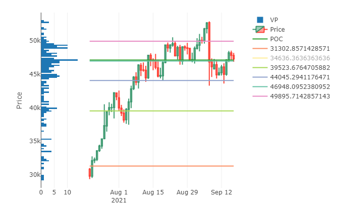
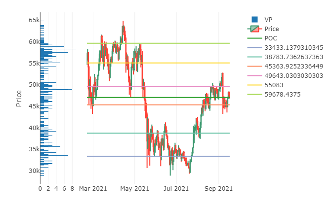

# Volume_Profile_Kmeans

The purpose of this project was the explore kmeans as a method in determining price levels with higher trading frequencies: in the field of technical analysis, these regions are known as support and resistance levels. Support and resistance (S&R) are common trading techniques, and can be visually estimated and identitified which makes it an easy task to determine the viability of kmeans in this process.

## Volume Profile

Volume profile, a histogram of high density trading areas found to the right of the left of a chart, was a key factor in this exploratory analysis as the binning methods were used as the variables in the K-means algorithm. **It is important to note that it is standard practice to standardize these variables as the kmeans algorithm uses to euclidean distances between each point for the cluster method but no standardization took place in part due to the fact that the price differences are important as well as the count of the bins is a descrete variable.**

## Results

## Conclusion
Based on the following images above, binning price data effectively produced a volume profile (seen on the left), and the K-means algorithm identified possible support and resistance levels; however, improvements can be done to see determine if there are better methods at identifying (S&R) whether it is with different alogrithms or the continued use of K-means.

## Improvements
I will return to this project for improvements which include but not limited to:
    - Comparing different ML methods
    - Altering weights for K-means algo
    - Automating the Binning process
    - Extracting levels without reprinting the graphs
    - Back testing strategies
    - Adding notes and setting up YAML options for fast reporting